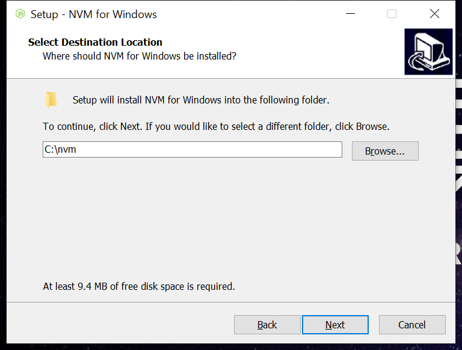
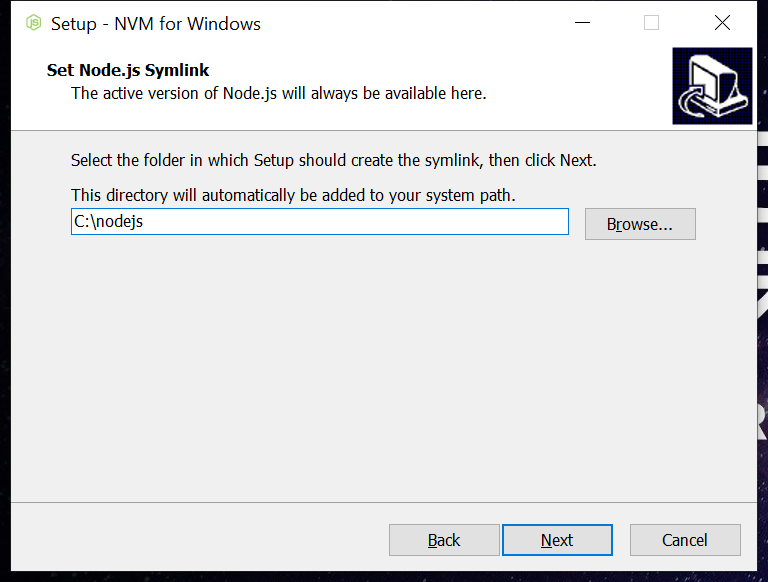

- [Configure the development environment](#configure-the-development-environment)
  - [Install NVM](#install-nvm)
  - [Install Node.js](#install-nodejs)
  - [Install Angular CLI](#install-angular-cli)

# Configure the development environment
This Wiki is about how to configure the development environment that angular trainning project

## Install NVM
1. Please make sure NVM and Node.js were **uninstalled**
2. Access [NVM](https://github.com/coreybutler/nvm-windows/releases) website, select "nvm-setup.zip" and install it like below screenshot


3. Run the following command in CMD to verify that NVM was installed successfully
```
nvm version
```
4. Run the following command in CMD in orderly
```
nvm node_mirror https://npm.taobao.org/mirrors/node/
nvm npm_mirror https://npm.taobao.org/mirrors/npm/
```

## Install Node.js
1. Run the following command in CMD
```
nvm install 16.14.2
```
2. Run the following command in CMD **as administrator** after installed completely
```
nvm use 16.14.2
```
3. Run the following command in CMD to verify that Node.js was installed successfully
```
node -v
```

## Install Angular CLI
1. Run the following command in CMD that make sure Angular CLI was uninstalled
```
npm uninstall @angular/cli --global
```
2. Run the following command in CMD that install Angular CLI globally
```
npm install @angular/cli@13.3.8 --global
```
3. Run the following command in CMD to verify that Angular CLI version is 13.3.8
```
ng version
```

Next Step: [Setup Framework](./1.setup-framework.md)
