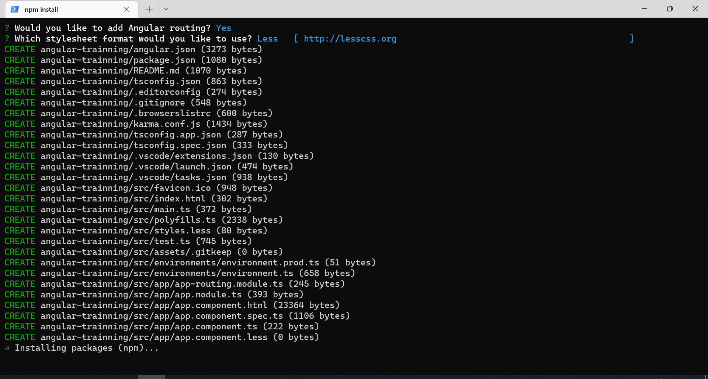
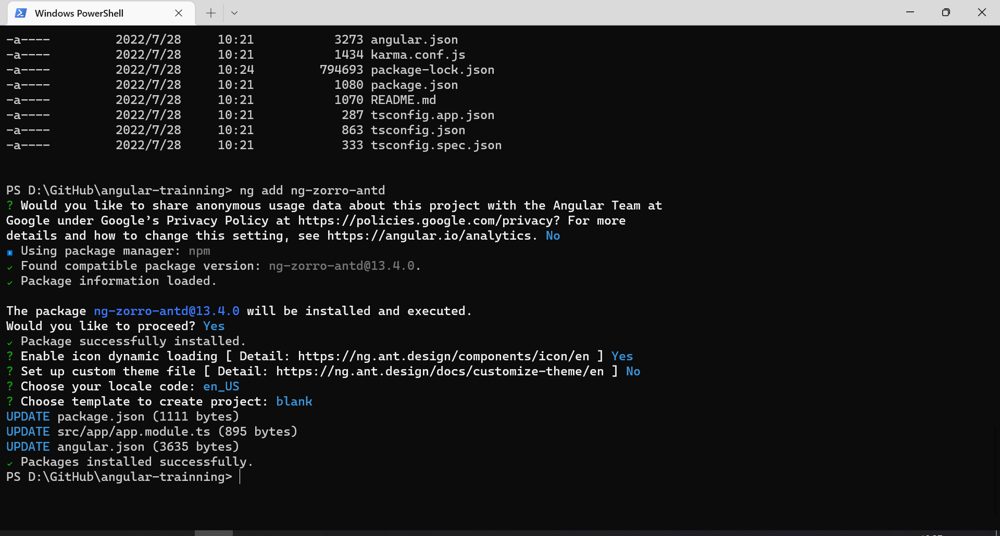

- [Setup Framework](#setup-framework)
  - [Setup Angular](#setup-angular)
  - [Setup NG-ZORRO](#setup-ng-zorro)
  - [Integrate NG-ZORRO](#integrate-ng-zorro)

# Setup Framework
This Wiki is about how to setup a basic Angular framework

## Setup Angular
1. Run the following command in CMD that setup a Angular framework
```
ng new [PROJECT NAME]
```
2. Select following settings and wait for installed the package completely


## Setup NG-ZORRO
1. Run the following command in CMD that go to the root directory of project
```
cd [PROJECT NAME]
```
1. Run the following command that setup NG-ZORRO
```
ng add ng-zorro-antd
```
2. Select following settings and wait for installed the package completely


## Integrate NG-ZORRO
1. Run the following command in CMD that create a shared module file
```
ng generate module ../shared/shared --flat
```
2. Locate the "shared.module.ts" file and replace the code like below
```typescript
// src\shared\shared.module.ts
import { NgModule } from '@angular/core';

import { CommonModule } from '@angular/common';
import { FormsModule, ReactiveFormsModule } from '@angular/forms';
import { RouterModule } from '@angular/router';
import { HttpClientModule } from '@angular/common/http';

import { NzAffixModule } from 'ng-zorro-antd/affix';
import { NzAlertModule } from 'ng-zorro-antd/alert';
import { NzAnchorModule } from 'ng-zorro-antd/anchor';
import { NzAutocompleteModule } from 'ng-zorro-antd/auto-complete';
import { NzAvatarModule } from 'ng-zorro-antd/avatar';
import { NzBackTopModule } from 'ng-zorro-antd/back-top';
import { NzBadgeModule } from 'ng-zorro-antd/badge';
import { NzBreadCrumbModule } from 'ng-zorro-antd/breadcrumb';
import { NzButtonModule } from 'ng-zorro-antd/button';
import { NzCalendarModule } from 'ng-zorro-antd/calendar';
import { NzCardModule } from 'ng-zorro-antd/card';
import { NzCarouselModule } from 'ng-zorro-antd/carousel';
import { NzCascaderModule } from 'ng-zorro-antd/cascader';
import { NzCheckboxModule } from 'ng-zorro-antd/checkbox';
import { NzCollapseModule } from 'ng-zorro-antd/collapse';
import { NzCommentModule } from 'ng-zorro-antd/comment';
import { NzNoAnimationModule } from 'ng-zorro-antd/core/no-animation';
import { NzTransButtonModule } from 'ng-zorro-antd/core/trans-button';
import { NzWaveModule } from 'ng-zorro-antd/core/wave';
import { NzDatePickerModule } from 'ng-zorro-antd/date-picker';
import { NzDescriptionsModule } from 'ng-zorro-antd/descriptions';
import { NzDividerModule } from 'ng-zorro-antd/divider';
import { NzDrawerModule } from 'ng-zorro-antd/drawer';
import { NzDropDownModule } from 'ng-zorro-antd/dropdown';
import { NzEmptyModule } from 'ng-zorro-antd/empty';
import { NzFormModule } from 'ng-zorro-antd/form';
import { NzGridModule } from 'ng-zorro-antd/grid';
import { NzI18nModule } from 'ng-zorro-antd/i18n';
import { NzIconModule } from 'ng-zorro-antd/icon';
import { NzImageModule } from 'ng-zorro-antd/image';
import { NzInputModule } from 'ng-zorro-antd/input';
import { NzInputNumberModule } from 'ng-zorro-antd/input-number';
import { NzLayoutModule } from 'ng-zorro-antd/layout';
import { NzListModule } from 'ng-zorro-antd/list';
import { NzMentionModule } from 'ng-zorro-antd/mention';
import { NzMenuModule } from 'ng-zorro-antd/menu';
import { NzMessageModule } from 'ng-zorro-antd/message';
import { NzModalModule } from 'ng-zorro-antd/modal';
import { NzNotificationModule } from 'ng-zorro-antd/notification';
import { NzPageHeaderModule } from 'ng-zorro-antd/page-header';
import { NzPaginationModule } from 'ng-zorro-antd/pagination';
import { NzPopconfirmModule } from 'ng-zorro-antd/popconfirm';
import { NzPopoverModule } from 'ng-zorro-antd/popover';
import { NzProgressModule } from 'ng-zorro-antd/progress';
import { NzRadioModule } from 'ng-zorro-antd/radio';
import { NzRateModule } from 'ng-zorro-antd/rate';
import { NzResultModule } from 'ng-zorro-antd/result';
import { NzSegmentedModule } from 'ng-zorro-antd/segmented';
import { NzSelectModule } from 'ng-zorro-antd/select';
import { NzSkeletonModule } from 'ng-zorro-antd/skeleton';
import { NzSliderModule } from 'ng-zorro-antd/slider';
import { NzSpaceModule } from 'ng-zorro-antd/space';
import { NzSpinModule } from 'ng-zorro-antd/spin';
import { NzStatisticModule } from 'ng-zorro-antd/statistic';
import { NzStepsModule } from 'ng-zorro-antd/steps';
import { NzSwitchModule } from 'ng-zorro-antd/switch';
import { NzTableModule } from 'ng-zorro-antd/table';
import { NzTabsModule } from 'ng-zorro-antd/tabs';
import { NzTagModule } from 'ng-zorro-antd/tag';
import { NzTimePickerModule } from 'ng-zorro-antd/time-picker';
import { NzTimelineModule } from 'ng-zorro-antd/timeline';
import { NzToolTipModule } from 'ng-zorro-antd/tooltip';
import { NzTransferModule } from 'ng-zorro-antd/transfer';
import { NzTreeModule } from 'ng-zorro-antd/tree';
import { NzTreeViewModule } from 'ng-zorro-antd/tree-view';
import { NzTreeSelectModule } from 'ng-zorro-antd/tree-select';
import { NzTypographyModule } from 'ng-zorro-antd/typography';
import { NzUploadModule } from 'ng-zorro-antd/upload';
import { NzResizableModule } from 'ng-zorro-antd/resizable';
import { NzPipesModule } from 'ng-zorro-antd/pipes';

const nzModules = [
  NzAffixModule,
  NzAlertModule,
  NzAnchorModule,
  NzAutocompleteModule,
  NzAvatarModule,
  NzBackTopModule,
  NzBadgeModule,
  NzButtonModule,
  NzBreadCrumbModule,
  NzCalendarModule,
  NzCardModule,
  NzCarouselModule,
  NzCascaderModule,
  NzCheckboxModule,
  NzCollapseModule,
  NzCommentModule,
  NzDatePickerModule,
  NzDescriptionsModule,
  NzDividerModule,
  NzDrawerModule,
  NzDropDownModule,
  NzEmptyModule,
  NzFormModule,
  NzGridModule,
  NzI18nModule,
  NzIconModule,
  NzImageModule,
  NzInputModule,
  NzInputNumberModule,
  NzLayoutModule,
  NzListModule,
  NzMentionModule,
  NzMenuModule,
  NzMessageModule,
  NzModalModule,
  NzNoAnimationModule,
  NzNotificationModule,
  NzPageHeaderModule,
  NzPaginationModule,
  NzPopconfirmModule,
  NzPopoverModule,
  NzProgressModule,
  NzRadioModule,
  NzRateModule,
  NzResultModule,
  NzSegmentedModule,
  NzSelectModule,
  NzSkeletonModule,
  NzSliderModule,
  NzSpaceModule,
  NzSpinModule,
  NzStatisticModule,
  NzStepsModule,
  NzSwitchModule,
  NzTableModule,
  NzTabsModule,
  NzTagModule,
  NzTimePickerModule,
  NzTimelineModule,
  NzToolTipModule,
  NzTransButtonModule,
  NzTransferModule,
  NzTreeModule,
  NzTreeViewModule,
  NzTreeSelectModule,
  NzTypographyModule,
  NzUploadModule,
  NzWaveModule,
  NzResizableModule,
  NzPipesModule,
];

const modules = [
  CommonModule,
  FormsModule,
  RouterModule,
  ReactiveFormsModule,
  HttpClientModule,
  ...nzModules,
];

@NgModule({
  exports: modules,
})
export class SharedModule {}

```
3. Run the following command in CMD that create admin module
```
ng generate module ../modules/admin --routing
```
4. Run the following command in CMD that create admin users component
```
ng generate component ../modules/admin/users
```
5. Run the following command in CMD that create admin roles component
```
ng generate component ../modules/admin/roles
```
6. import the shared module into the admin module like below
```typescript
// src\modules\admin\admin.module.ts
@NgModule({
  declarations: [UsersComponent, RolesComponent],
  imports: [SharedModule, AdminRoutingModule],  // import shared module here
})
export class AdminModule {}

```
7. configure the admin routing module like below
```typescript
// src\modules\admin\admin-routing.module.ts
const routes: Routes = [
  { path: '', redirectTo: 'users', pathMatch: 'full' },
  { path: 'users', component: UsersComponent },
  { path: 'roles', component: RolesComponent },
];
```
8. Integrate the admin routing module into the app routing module like below
```typescript
// src\app\app-routing.module.ts
const routes: Routes = [
  { path: '', redirectTo: 'system', pathMatch: 'full' },
  { path: 'system', loadChildren: () => AdminModule },
];
```
9. import the shared module into the app module like below
```typescript
// src\app\app.module.ts
@NgModule({
  declarations: [AppComponent],
  imports: [
    BrowserModule,
    AppRoutingModule,
    FormsModule,
    HttpClientModule,
    BrowserAnimationsModule,
    SharedModule, // import shared module here
  ],
  providers: [{ provide: NZ_I18N, useValue: en_US }],
  bootstrap: [AppComponent],
})
export class AppModule {}

```
10. redesign the app component html and replace the code like below
```html
<!-- src\app\app.component.html -->
<nz-layout>
  <nz-sider nzCollapsible nzWidth="200px">
    <div class="logo"></div>
    <ul nz-menu nzTheme="dark" nzMode="inline">
      <li nz-submenu nzTitle="Admin" nzIcon="setting" nzOpen>
        <ul>
          <li nz-menu-item routerLink="/system/users" nzMatchRouter>
            <i nz-icon nzType="user"></i>
            <span>Users</span>
          </li>
          <li nz-menu-item routerLink="/system/roles" nzMatchRouter>
            <i nz-icon nzType="user-switch"></i>
            <span>Roles</span>
          </li>
        </ul>
      </li>
    </ul>
  </nz-sider>
  <nz-layout>
    <nz-header></nz-header>
    <nz-content>
      <router-outlet></router-outlet>
    </nz-content>
    <nz-footer>Ant Design ©2020 Implement By Angular</nz-footer>
  </nz-layout>
</nz-layout>
```
```less
// src\app\app.component.less
.logo {
  height: 32px;
  margin: 16px;
  background: rgba(255, 255, 255, 0.3);
}

nz-header {
  background: #fff;
  padding: 0;
}

nz-content {
  margin: 0 16px;
}

:host ::ng-deep nz-breadcrumb {
  margin: 16px 0;
}

:host ::ng-deep .inner-content {
  padding: 24px;
  background: #fff;
  min-height: 360px;
}

nz-footer {
  text-align: center;
}

```
11. Run the following command in CMD and launch the browser and access "http://localhost:4200/"
```
npm start
```
12. Enjoy it!:coffee::coffee::coffee:

Previous Step: [Configure the development environment](./0.configure-the-development-environment.md)
Next Step: [Create roles page](./2.create-roles-page.md)
